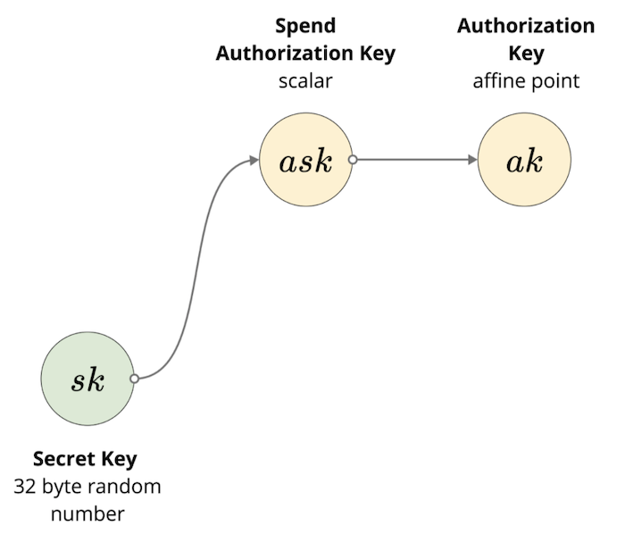
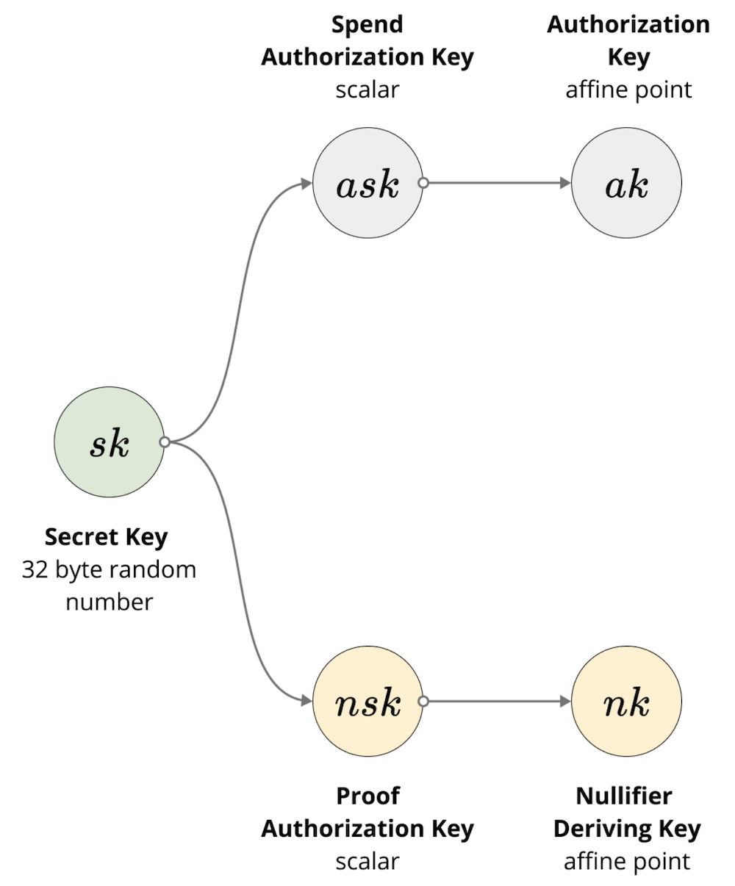
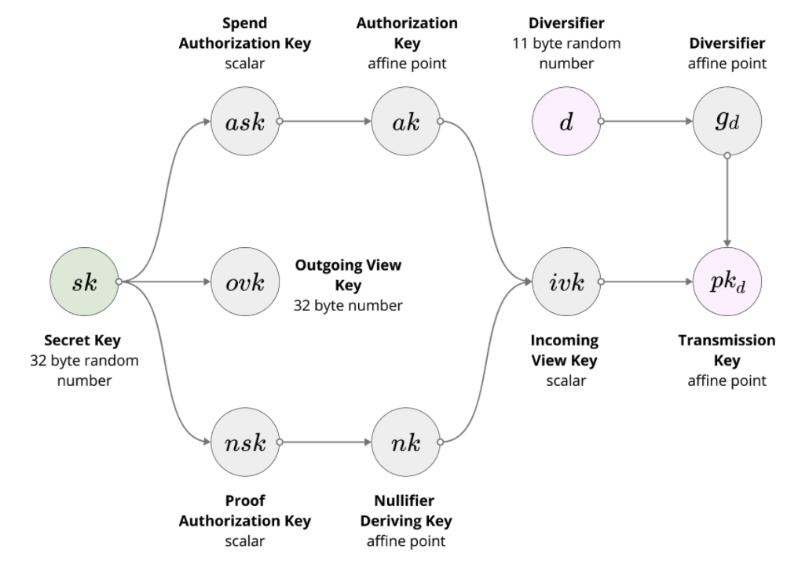

The only way to modify the global state of the Iron Fish blockchain is to generate a transaction. We’ll start first describing the structure of all the necessary components and later describe how transactions are made and verified.

## Transaction

On a high level, a transaction has Spend and Output descriptions: the Spend descriptions dictate which notes are being consumed as part of that transaction, and Output description describes which new notes are created such that no new money is created or destroyed. We define the Spend and Output descriptions further in the paper. This is very similar to the UTXO model in Bitcoin in regards to how UTXOs are treated in a transaction.

A transaction consists of:
- $$transaction\_fee$$: an i64 number representing the transaction fee
- $$spends$$: a list of Spend descriptions for that transaction
- $$receipts$$: a list of Output description for that transaction
- $$binding\_signature$$: a signature used to balance the transaction during verification

## Note

A *note* is a representation of a spendable form of payment, like a bill. It is very similar to a UTXO in Bitcoin. A note is only ever referenced publicly when it is created as an output of a transaction, and only in its hashed form. The contents of the note themselves are private.

The plaintext contents of a note are:
- $$(pk, d)$$: the transmission key and the diversifier of the recipient’s address (e.g. the owner of the note’s public key which we’ll explain in the Account section)
- $$v$$      : the plaintext value that the note holds
- $$rcm$$    : note randomness used to generate a Pedersen hash for the note
- $$memo$$   : a 32-byte memo field

## Full Merkle Tree Note

When syncing the Merkle tree and asking the network for the leaves of the said Merkle tree, the request asks a bit more information than just the encrypted note.

Full Merkle Tree Note consists of:
- $$cv$$		  : value commitment
- $$cm$$ 		  : note commitment
- $$epk$$ 		  : ephemeral public key
- $$C^{enc}$$ 	  : encrypted plaintext of the note
- $$C^{out}$$	  : allows the holder of the viewing key to decrypt a decryption key for $$C^{enc}$$

This allows the owner of the note to not need to download the specific block or transaction that resulted in this note, as all the information to spend it is encompassed here.

## Nullifier

A nullifier is a unique identifier to a note such that when it is revealed as part of the Spend Description, that note cannot be spent again. This is because you can only spend the note by revealing its nullifier, and the nullifier is derived from `ivk` (incoming view key), `cm` (note commitment), and `position` (index in the Merkle tree). Note that the incoming view key is derived by hashing (via blake2s) the bytes of the authorizing key with the bytes of the nullifier deriving key and converting it into a scalar.

## Account

Every account comes with a secret key, a spending key pair, a nullifier key pair, a view key pair, and a public address. We’ll explain why all these parts are needed as we go along.

### Secret key

1. The secret key is simply a 32-byte random number. This is the seed necessary to construct all other parts of your wallet.

### Spend Authorization Key and Authorization Key
1. The _Spend Authorization Key_ ($$ask$$) is derived by hashing the secret key and a modifier using the [Blake2b](https://blake2.net/) hashing algorithm (with personalization params) and then converting it into a scalar for the Jubjub curve. Think of this as the derived private key for spending notes.
    1. (TODO: link to exact implementation with exact parameters and modifier)

2. The _Authorization Key_ ($$ak$$) is derived as the public key for the spend authorization key by multiplying the spend authorizing key with a fixed generator base point for it (see Jubjub section in the appendix for more details on curve parameters).
$$ak = ask * G_{ak}$$
$$ak$$ is then the _public key of the spend authorization key_
$$ak$$ is used to sign each _Spend description_

### Proof Authorization Key and Nullifier Deriving Key
1. The _Proof Authorization Key_ ($$nsk$$) is derived by hashing the secret key and a modifier using Blake2b (with params) and then converting it into a scalar (integer) for the Jubjub curve
    1. (TODO: link to exact implementation with exact parameters and modifier)

2. The _Nullifier Deriving Key_ ($$nk$$)  is derived by multiplying proof authorizing key with a fixed generator base point ($$G_{nk}$$)
    1. $$nk = nsk * G_{nk}$$
    2. $$nk$$ is then the _public key_ of the proof authorization key
    3. $$nk$$ is used to create a _nullifier per note_

### Incoming and Outgoing View Key
1. The Outgoing View Key `(ovk)` allows for decrypting outgoing transactions. It is derived by hashing the secret key and a modifier using Blake2b (with params) and then taking the first 32 bytes of the result

2. The Incoming View Key `(ivk)` allows for decrypting incoming transactions. It is derived by hashing (via blake2s) the bytes of the authorizing key with the bytes of the nullifier deriving key and converting it into a Jubjub scalar
    1. `ivk = hash(ak, nk) → jubjub scalar`

### Public Key
1. The public key consists of a Transmission Key and a Diversifier. Together, they enable a single wallet with a single private key to contain unlimited public addresses

2. The Diversifier $$(d)$$ is a random 11-byte number used to randomize the final public address
    1. The diversifier is then converted into an affine point on the Jubjub curve, $$g_d$$
3. The Transmission Key $$(pk_d)$$ is derived by multiplying the diversifier (converted to an affine point on the Jubjub curve) by the incoming view key:
    1. $$pk_d = g_d * ivk$$
4. Together, the Diversifier and Transmission key, make up a Public Key
    1. $$(d, pk_d)$$ is the public key
        1. 43-byte number (11 bytes for diversifier + 32 bytes for transmission key)

The complexity of this construction comes from separating out the spending power from the viewing keys. This way, the key is constructed such that one derived key pair is responsible for signing the notes in a Spend description and another to view incoming and outgoing transactions.

## Merkle Tree of Notes

One of the two global data structures for Iron Fish is the Merkle tree of notes. This is a fixed size Merkle tree of depth 32 that holds all the notes ever created. Unlike in other blockchains where a UTXO is removed after it is spent, this Merkle Tree is an add-only data structure where notes are added sequentially to the tree.

Note that in the case of the Merkle tree of notes being completely full, a new Merkle tree will simply be constructed and the old one marked as read-only.

(TODO transfer over some of Dusty’s tutorial on Merkle Trees for background knowledge)

## Merkle Tree of Nullifiers

The other of the global data structures is the Merkle tree of nullifiers. It is also a fixed size Merkle tree of depth 32 that holds all the nullifiers ever revealed for the notes they’ve spent.

## Block Header
A Block Header consists of:
- `sequence` – The sequence number of this block. Blocks in a chain increase in ascending order of sequence. More than one block may have the same sequence number (indicating a fork in the chain), but only one fork is selected at a time.
previous_block_hash – The hash of the previous block in the chain.
- `note_commitment` – Commitment to the merkle tree for notes after all new notes from transactions in this block have been added to it. Stored as the hash and the size of the tree at the time the hash was calculated.
- `nullifier_commitment` – Commitment to the nullifier set after all the spends in this block have been added to it. Stored as the hash and the size of the set at the time the hash was calculated.
- `target` – The hash of this block must be lower than this target value in order for the block to be accepted onto the chain.
- `randomness` – The nonce used to calculate this block’s hash
- `timestamp` – Unix timestamp according to the miner who mined the block. This value must be taken with a grain of salt, but miners will want to verify that it's an appropriate distance to the previous block's timestamp.
- `miners_fee` – A single (simplified) transaction representing the miners fee consisting only of one Output Description

## Block

The block is simply a list of transactions and the Block Header.

