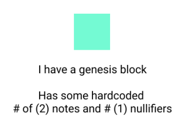
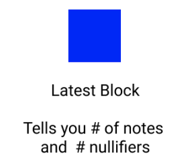
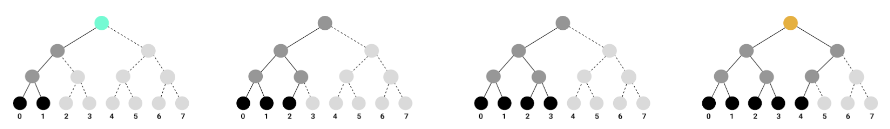
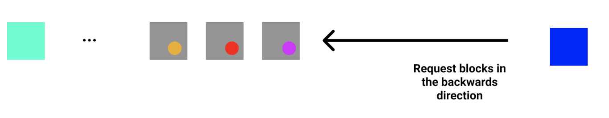
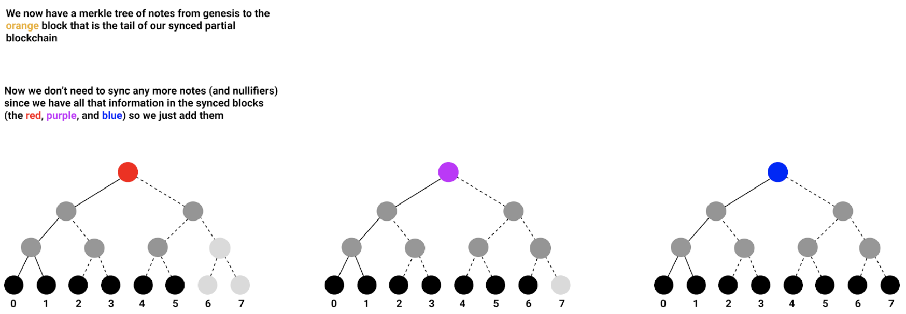

## Background Context

Iron Fish has two global sets that get updated by every transaction that is included in the block: the global Merkle tree of **Notes** and another global Merkle tree of **Nullifiers**. Both Merkle trees are of height 32 and so there are $$2^{32}$$ leaves. These are two data sets you need to be fully synced.

The Iron Fish Block Header looks like this:
```
BlockHeader {
	previous_block_hash
	note_commitment
	nullifier_commitment
	... //<omitted fields>
}
```

**note_commitment** has:
- Merkle tree root for the Merkle tree of **Notes**
- **size** of the tree (how many leaves it has)

**nullifier_commitment** has:
- Merkle tree root for the Merkle tree of **Nullifiers**
- **size** of the tree (how many leaves it has)

## How it Works

### Step 0:

Every node has a hardcoded genesis block built-in. The genesis block has two notes and one nullifier.



### Step 1:

The node asks the network for the latest block. Generally, it will ask several nodes to make sure it has a consistent answer and assume the latest block is honest.
If the latest block is not honest, the node will find this out very quickly when attempting to sync more data using its information and switch to a chain that has the most work.

The latest block will give the total number of notes and the total number of nullifiers in the two global sets that are needed to download in order to rebuild the two global Merkle trees.



### Step 2:

Now that you know how many notes and nullifiers there are, and that they are added sequentially and in order at every block, you can start asking the network for those leaf notes to start rebuilding your two sets.

For example, if we had a Notes Merkle tree of height 3 (so $$2^3$$ leaves) and the Latest Block told us we should have 8 notes, then we could start downloading notes sequentially starting from the two we already had from the **genesis block**:



**At the same time, in parallel, we would also start downloading blocks going backward from the Latest Block**



This happens until the node downloads a block that contains the Merkle tree root that it already has from requesting the notes and rebuilding its tree locally (in this case, it would be the orange Merkle tree root).

### Step 5:
We need to finish building our Merkle tree of notes up to the latest block (the blue block). At this point, we've downloaded all the blocks between the orange one that we have all the data for already in our tree, up to the blue one. We don't need to sync any more data because the data that we are missing from our tree is in the blocks we've downloaded, so we add the notes in the blocks we have to our tree.



At this point, **we don't need any other information** because we have our data structures that we can link from the latest block all the way to the genesis block. This technique gives the same security guarantees as if we would have downloaded every block fully from the genesis block, but without downloading and processing data we don't need.

### Catching Up After Some Downtime:

If your node has been offline for several blocks, then to catch up on the steps are:
  1. Request Latest Block.
  2. If the latest block’s timestamp is ahead of the current head of the heaviest chain, request in batches blocks between the latest & current head block.
  3. If they match up and the head of the heaviest chain is connected to the latest block, the latest block becomes the heaviest chain.
  4. There’s no need to download any notes/nullifiers since they are all contained in the already downloaded blocks.


## What Are the Exact Savings?


Let's assume an average transaction has 2 inputs (Spends) and 2 outputs. Then the size of that transaction would be $$388 * 2\ bytes$$ for the Spends, $$499 * 2\ bytes$$ for the Outputs, 64 bytes for the signature, and 8 bytes for the fee, for a total of **1774 bytes**. Out of all that, Optimistic Sync would require just the Merkle note to be added to the Notes tree (which is 307 bytes) and the nullifier to be added to the Nullifier tree (32 bytes) for a total of $$307 * 2 + 32 * 2 = 678\ bytes$$.

By requesting 678 bytes instead of 1774 bytes we are requesting just ~38% of the entire transaction! That means, (if the average transaction has 2 inputs and 2 outputs), with Optimistic Sync we would have **over 60% in savings of what we need to download for a full node!**

