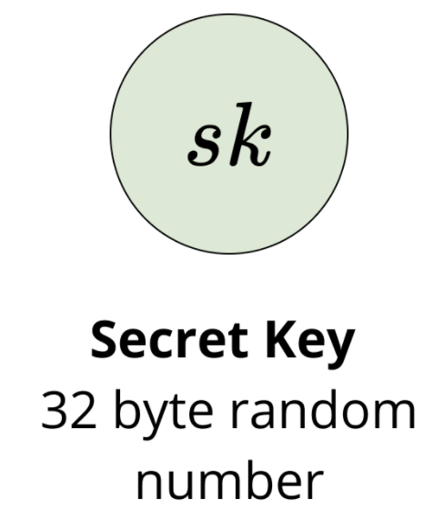
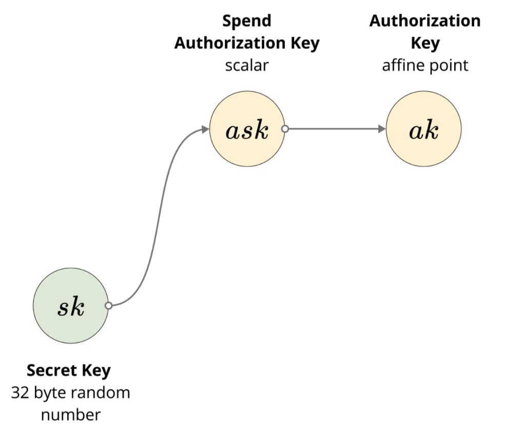

The only way to modify the global state of the Iron Fish blockchain is to generate a transaction. We’ll start first describing the structure of all the necessary components and later describe how transactions are made and verified.

## Transaction

On a high level, a transaction has Spend and Output descriptions: the Spend descriptions dictate which notes are being consumed as part of that transaction, and Output description describes which new notes are created such that no new money is created or destroyed. We define the Spend and Output descriptions further in the paper. This is very similar to the UTXO model in Bitcoin in regards to how UTXOs are treated in a transaction.

A transaction consists of:
- `transaction_fee`: an i64 number representing the transaction fee
- `spends`: a list of Spend descriptions for that transaction
- `receipts`: a list of Output description for that transaction
- `binding_signature`: a signature used to balance the transaction during verification

## Note

A *note* is a representation of a spendable form of payment, like a bill. It is very similar to a UTXO in Bitcoin. A note is only ever referenced publicly when it is created as an output of a transaction, and only in its hashed form. The contents of the note themselves are private.

The plaintext contents of a note are:
-`(pk, d)`: the transmission key and the diversifier of the recipient’s address (e.g. the owner of the note’s public key which we’ll explain in the Account section)
- `v`     : the plaintext value that the note holds
- `rcm`   : note randomness used to generate a Pedersen hash for the note
- `memo`  : a 32-byte memo field

## Full Merkle Tree Note

When syncing the Merkle tree and asking the network for the leaves of the said Merkle tree, the request asks a bit more information than just the encrypted note.

Full Merkle Tree Note consists of:
- `cv`		  : value commitment
- `cm` 		  : note commitment
- `epk` 		: ephemeral public key
- `C^enc` 	: encrypted plaintext of the note
- `C^out`	 	: allows the holder of the viewing key to decrypt a decryption key for `C^enc`

This allows the owner of the note to not need to download the specific block or transaction that resulted in this note, as all the information to spend it is encompassed here.

## Nullifier

A nullifier is a unique identifier to a note such that when it is revealed as part of the Spend Description, that note cannot be spent again. This is because you can only spend the note by revealing its nullifier, and the nullifier is derived from `ivk` (incoming view key), `cm` (note commitment), and `position` (index in the Merkle tree). Note that the incoming view key is derived by hashing (via blake2s) the bytes of the authorizing key with the bytes of the nullifier deriving key and converting it into a scalar.

## Account

Every account comes with a secret key, a spending key pair, a nullifier key pair, a view key pair, and a public address. We’ll explain why all these parts are needed as we go along.

### Secret key

1. The secret key is simply a 32-byte random number. This is the seed necessary to construct all other parts of your wallet.

### Spend Authorization Key and Authorization Key
1. The _Spend Authorization Key_ (`ask`) is derived by hashing the secret key and a modifier using the [Blake2b](https://blake2.net/) hashing algorithm (with personalization params) and then converting it into a scalar for the Jubjub curve. Think of this as the derived private key for spending notes.
    1. (TODO: link to exact implementation with exact parameters and modifier)

2. The _Authorization Key_ (`ak`) is derived as the public key for the spend authorization key by multiplying the spend authorizing key with a fixed generator base point for it (see Jubjub section in the appendix for more details on curve parameters).
`ak = ask * Gak`
`ak` is then the _public key of the spend authorization key_
`ak` is used to sign each _Spend description_

### Proof Authorization Key and Nullifier Deriving Key
1. The _Proof Authorization Key_ (`nsk`) is derived by hashing the secret key and a modifier using Blake2b (with params) and then converting it into a scalar (integer) for the Jubjub curve
    1. (TODO: link to exact implementation with exact parameters and modifier)

2. The _Nullifier Deriving Key_ (`nk`)  is derived by multiplying proof authorizing key with a fixed generator base point (`Gnk`)
    1. `nk = nsk * Gnk`
    2. `nk` is then the _public key_ of the proof authorization key
    3. `nk` is used to create a _nullifier per note_

